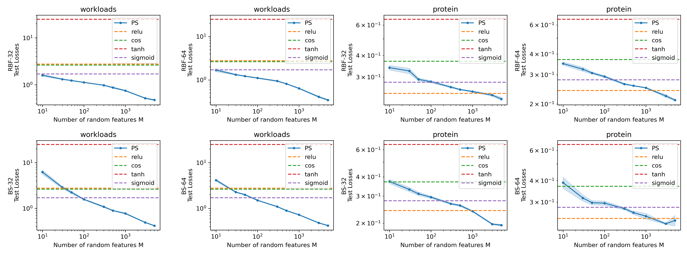
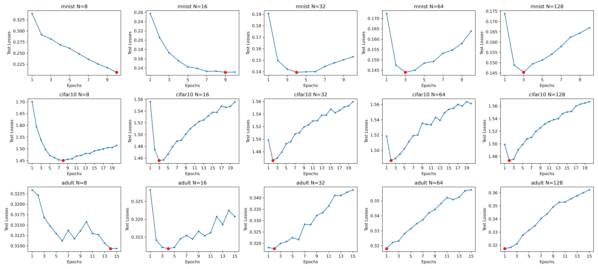

### Figure 1


We compare RFLAF of different widths with RFMLP with four fixed activation functions. The width of RFMLP is 3000. RFLAF is able to achieve the same level of losses with a smaller number of random features $M$. For example, in data workloads, for RBF-32 with BS as activation, the model surpasses the best of RFMLP (M=3000) with only M=100, but the learnable parameter number of RFLAF is only 100+32=132 << 3000. Even consider the frozen parameter, it is $(d+1) *100 + 32 << (d+1) *3000$, with $d$ the input dimension. Similar results hold for other models and data. This demonstrates that RFLAF is able to surpass standard RF models with substantially fewer number of parameters.

### Figure 2


We can see that as $N$ grows, the convergence epoch number is decreasing (red point moving left), indicating that the model's convergence speed rapidly increases as $N$ grows. For $N \geq 32$, the model found the minimal within just several epochs. This shows that RFLAF is easy to train and converges with very simple optimization setup. And the convergence speed is fast.

------------------------------

Generating synthetic data:
```
python gen_data.py --task_name sin
python gen_data.py --task_name tru
python gen_data.py --task_name zoi
```
sin, tru, zoi stand for $f_1, f_2, f_3$.

For training RFLAFs, run
```
nohup bash runN.sh &
```

For training RFMLPs as comparisons, run
```
nohup bash runNmlp.sh &
```

Figures and tables in the paper can be found in Experiments.ipynb