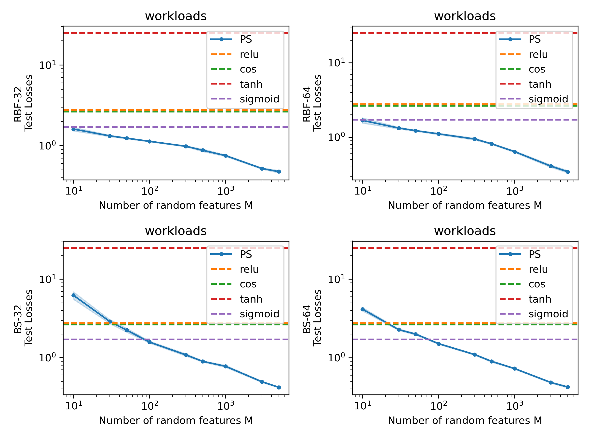
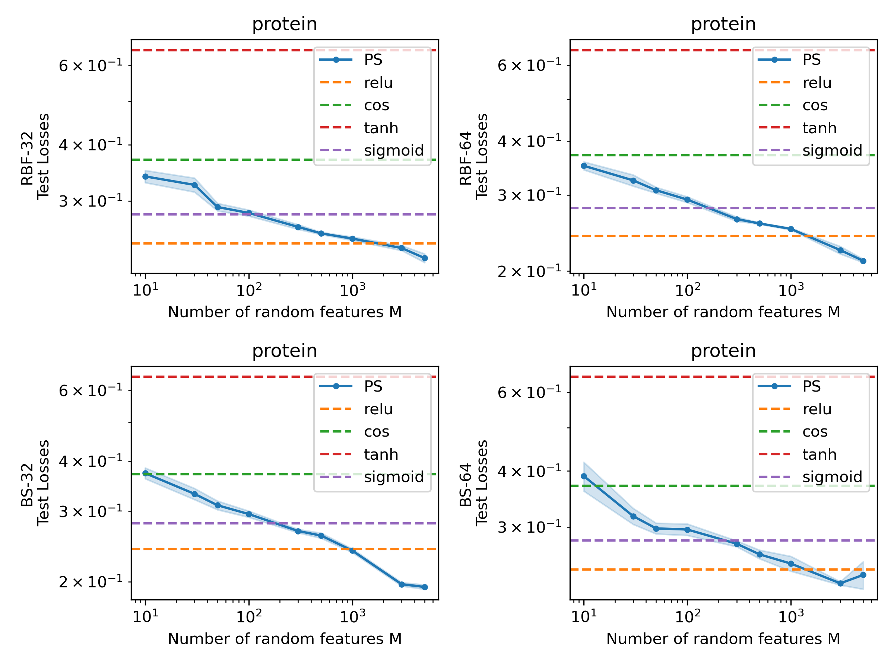

### Figure 1


### Figure 2


------------------------------

Generating synthetic data:
```
python gen_data.py --task_name sin
python gen_data.py --task_name tru
python gen_data.py --task_name zoi
```
sin, tru, zoi stand for $f_1, f_2, f_3$.

For training RFLAFs, run
```
nohup bash runN.sh &
```

For training RFMLPs as comparisons, run
```
nohup bash runNmlp.sh &
```

Figures and tables in the paper can be found in Experiments.ipynb